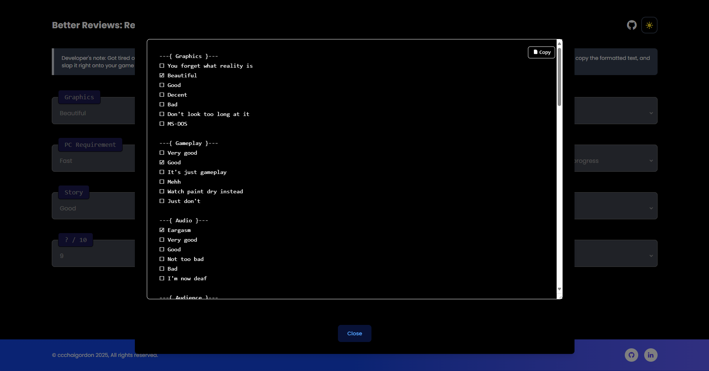
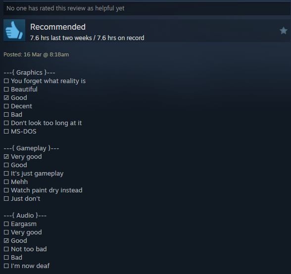

# Better Reviews 

Better Reviews: a streamlined tool designed to simplify the process of writing and sharing game reviews via predefined options then easily generate and copy formatted text to paste directly into their game reviews on platforms such as Steam.

 


## Features

- **Predefined Selections**: Choose from a curated list of responses to articulate your opinions on various game aspects efficiently.
- **Clipboard Functionality**: With a single click, copy your structured review to the clipboard.
- **Dark Mode**: Toggle between light and dark themes for enhanced usability in any environment.
- **Responsive Layout**: Ensures a seamless experience across both desktop and mobile devices.

## Getting Started

These instructions will get you a copy of the project up and running on your local machine for development and testing purposes.

### Prerequisites

This project requires Node.js, npm, and git installed on your machine. To install Node.js and npm, follow the instructions from the [Node.js official website](https://nodejs.org/). To install git, visit the [Git official website](https://git-scm.com/downloads).

### Installation

```bash
# Clone this repository
$ git clone https://github.com/ccchaigordon/Better-Reviews.git

# Navigate to the directory
$ cd Better-Reviews

# Install the dependencies
$ npm install

# Run the application
$ npm run dev
```

## Credits

This application uses the following open source packages:

- [Node.js](https://nodejs.org/)
- [Tailwind CSS](https://tailwindcss.com/)
- [Font Awesome](https://fontawesome.com/)

## License

Distributed under the MIT License. See LICENSE file for more information.
